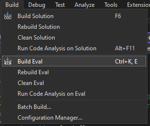
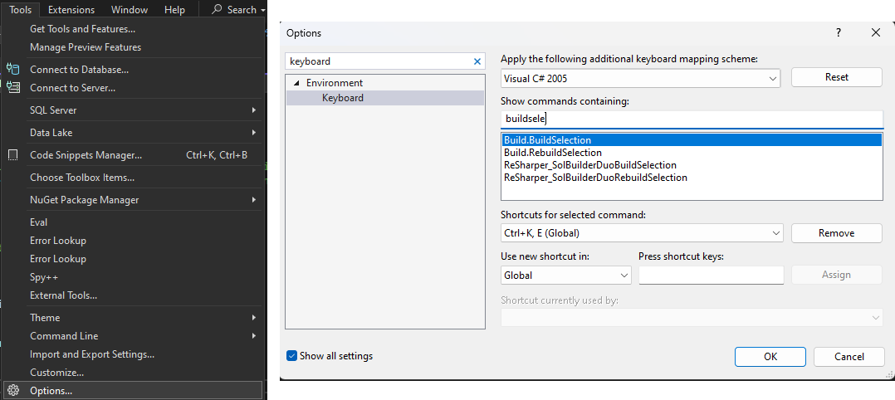

# C# REPL Example

(Companion blog post: [A C# REPL From Scratch in ~100 lines: Try out ideas without relaunching your program](https://infinitebeatsaber.substack.com/p/a-c-repl-from-scratch-in-100-lines).)

This repo shows how to use about 100 lines of code to wire up a multiline REPL that supports autocomplete for rapidly evaluating code in a running C# program.

Here's a screen recording showing my usage of this REPL while working on [a mod for the game Beat Saber](https://github.com/rigdern/InfiniteBeatSaber). When I’m ready to run the code, I hit a Visual Studio keyboard shortcut. I'm using the REPL to spawn different kinds of notes:


**What is a REPL?** A REPL enables you to execute code in a program that's already running. It also goes by names such as a developer console or the C# Immediate Window.

**Why use a REPL?** The shorter your feedback loop, the faster you can learn and the faster you can improve your program. A REPL facilitates a short feedback loop. You can write some code and see the results immediately. You don't have to wait for your program to recompile. You don't have to relaunch your program and renavigate back the screen that you were testing.

## Capabilities of this REPL
- **World-class autocomplete.** You write the REPL code in Visual Studio or whatever your editor of choice may be.
- **Multiline.** Execute as much code at a time as you like, whether it be 1 line or multiple classes.
- **Rapid feedback.** Evaluation happens within a second. You trigger evaluation with a keyboard shortcut within your editor. Your hands remain on the keyboard and focus remains within your editor so you can immediately begin tweaking your code upon observing the results of your previous evaluation.
- **Simple implementation, about 100 lines.**
  - **You can fully understand how the REPL works**. If you set it up in a new program you're developing and it's not working, you can figure out why.
  - **It's likely to work in many different kinds of C# programs.** For example, when developing mods for the game Beat Saber, your mods are running within the Beat Saber game and you don't have access to any of Beat Saber's source files or project files. This is a relatively uncommon development environment and it's not obvious to me how to get various tools, like the Unity Editor, to work in it. Yet it was easy to get this REPL implementation working with Beat Saber.

Despite its tiny implementation, this is the best C# REPL I've used. If you have some favorite REPL-like tools for C#, I'd be interested to hear about them.

## Repo Layout
- [`MyApp`](./MyApp). A C# console app project intended to represent whatever application you may be working on.
- [`Eval`](./Eval). The REPL project. Whatever you put in here gets injected into the running console app and executed. [`EvalProgram.EvalMain`](https://github.com/rigdern/REPLExample/blob/add-repl/Eval/EvalProgram.cs#L8-L11) is the entry point &mdash; the method that gets called after the code is injected.

## Usage Instructions
- Open [`REPLExample.sln`](./REPLExample.sln) in Visual Studio.
- Use the menu "Build > Build Solution" to build the solution.
- Use the menu "Debug > Start Without Debugging" to run the console app.
- Open the file [`Eval/EvalProgram.cs`](./Eval/EvalProgram.cs). This is the REPL file. Whatever code you put into this file will be injected into the running console app and executed.
- Use the menu "Build > Build Eval" to cause `EvalProgram.cs` to be built, injected into the running console app, and executed. If you haven't changed `EvalProgram.cs`, you should see this printed into the console for `MyApp`:
  ```
  value: 84
  ```

## Connecting Eval to a Keyboard Shortcut
I wanted to have a quick workflow for editing code in `EvalProgram.cs`, evaling it, editing it, evaling it, etc. So I wanted a convenient Visual Studio keyboard shortcut for triggering eval (i.e. building the `Eval` project).

Visual Studio has a menu item for building a project (in this case, it's labeled "Build Eval"):



I wired it up to the keyboard shortcut "Ctrl+K, E" which I wasn't using for anything else and is convenient to hit on my Dvorak keyboard.

Here's how you can set the keyboard shortcut:

1. In Visual Studio, choose the menu item "Tools > Options..."
1. In the dialog that opens, select "Keyboard" in the left pane.
1. In the selection list, click the item labeled "Build.BuildSelection".
1. Choose the desired keyboard shortcut using the input box labeled "Shortcuts for selected command".

Here's a screenshot that illustrates all of this UI:



## Learn more
- [A C# REPL From Scratch in ~100 lines: Try out ideas without relaunching your program](https://infinitebeatsaber.substack.com/p/a-c-repl-from-scratch-in-100-lines). This is a detailed blog post about this REPL, what it can do, and how it works.
- [Commit of all of the changes that were needed to add the REPL to the console app in this repo](https://github.com/rigdern/REPLExample/commit/add-repl). This could be a good starting point if you want to add the REPL to your own project.
- I used this REPL while developing a mod for the game Beat Saber called [Infinite Beat Saber](https://github.com/rigdern/InfiniteBeatSaber/). Check out its repo if you want to see another example of adding this REPL to a project.

## Limitations
- Cannot eval code while a debugger is attached to the program.
  - When you try to eval code, Visual Studio shows a "Do you want to stop debugging?" dialog. Evaling code is done by rebuilding the "Eval" project. This triggers Visual Studio's dialog because you usually don't want to rebuild a program while it's running. I'm not sure how to suppress this dialog for this REPL scenario.
- Does not work with Beat Saber version 1.29.1.
  - Only the first eval works properly. Subsequent evals re-execute the same code instead of the new code. This persists until the game is relaunched. I didn't investigate sufficiently but I suspect it's due to an issue in Unity or Mono. Beat Saber 1.29.1 uses:
    - Unity version: 2019.4.28
    - Mono version: 5.11.0 (Visual Studio built mono)
  - I verified that the REPL works fine in Beat Saber 1.31.0+.
  - I suspect the REPL works fine starting in Beat Saber 1.29.4 which upgraded Unity.

## License

[MIT](./LICENSE)
